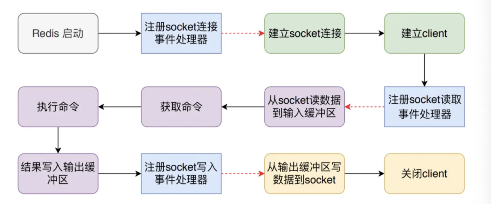
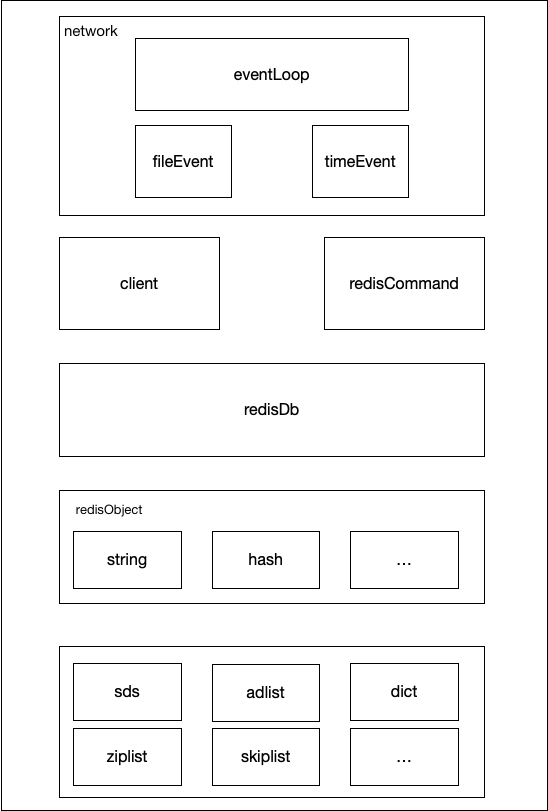
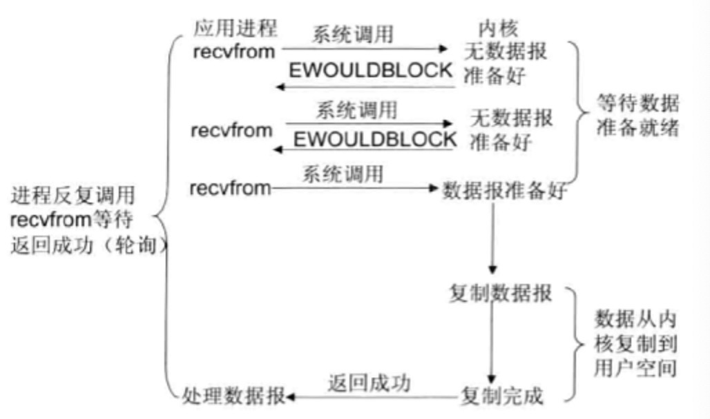

# Redis事件处理器

## Redis介绍

一句话描述：Redis是一款存储在**内存**中的Key-Value数据库。

与其他内存数据库相比，Redis具备以下几个特征：

* **单线程**处理命令

* 支持持久化操作

* 丰富的数据结构

## Redis结构

#### Redis命令执行过程

一条Redis命令从开始到结束可分为三个阶段：第一步是建立连接，包括服务启动时开启TCP服务器以及处理客户端的连接并创建client对象；第二步是处理阶段，从socket读取数据到输入缓冲区通过解析获得命令，执行命令将返回值存储到输出缓冲区中；第三步是数据返回阶段，将返回值从输出缓冲区中写到socket，返回给客户端并关闭client。具体如下图：




#### Redis架构




## 网络I/O模型

一个TCP服务器一定会包含绑定IP(bind)、监听端口(listen)、接受客户端的(accept)连接并处理(recv)，在客户端连接(connect)并发送(send)数据后，就可以实现进程之间的通信了。

```go
bind(127.0.0.1)
listenFd = listen(80)
while(true)
{
  fd = accept(listenFd)
 	data = recv(fd)
  process(data)
}
```

查阅资料我们可以得知accept、recv函数是阻塞的，那么就可能存在A、B两个连接先后到达服务端但是A连接并没有发送数据，从而导致整个程序就会在recv处阻塞从而无法处理B连接以及接收它的数据。

#### BIO(Blocking I/O)

阻塞I/0，通过多线程来解决recv阻塞的问题

    int main() 
    {
    	bind(127.0.0.1)
      listenFd = listen(80)
      while(true)
      {
      	fd = accept(listenFd)
        new Thread(() -> {
        	process(fd)
        }).start();
    	}
    }
    
    void process(fd) 
    {
    	while (true) {
      	data = recv(fd)
        	run(data)
    	}
    }

BIO模型确实解决了recv阻塞的问题，但一个连接对应一个线程，在高并发的情况下也会存在**线程创建过多**从而带来内存消耗大以及线程上下文切换的问题。

#### NIO(Non-Blocking I/O)

如果accept、recv函数不是阻塞的，那么是不是就可以不用创建过多线程？

linux平台上可以调用fcntl()或者ioctl()函数，实例如下：

```javascript
fcntl(sockfd, F_SETFL, fcntl(sockfd, F_GETFL, 0) | O_NONBLOCK);  
ioctl(sockfd, FIONBIO, 1);  //1:非阻塞 0:阻塞 
```

当对一个Non-Blocking Socket执行读操作时，流程如图所示：




NIO伪代码如下：

```
int main() 
{
    bind(127.0.0.1)
    listenFd = listen(80)
    fcntl(listenFd, F_SETFL, fcntl(sockfd, F_GETFL, 0) | O_NONBLOCK);  
    fds = []int
    while(true)
    {
    	fd = accept(listenFd)
      if (fd == SUCCESS) {
      	fcntl(fd, F_SETFL, fcntl(sockfd, F_GETFL, 0) | O_NONBLOCK); 
        fds = append(fds,fd)
      }
			for(i = 0;i<fds.length;i++) {
				data = recv(fds[i])
				if (data) {
					run(data)
				}
			}
   }
}
```

NIO模型因为其非阻塞的特性，使得它可以用单线程来处理多个网络并发I/O请求，在C10K的情况下，理论上也可以用一个线程来处理。

但是每次循环都要执行**O(n)**次recv的系统调用来获得每个文件描述符的就绪状态也使得它效率较低。


#### IO多路复用

通过**一次系统调用**将监听的文件描述符从用户态拷贝到内核态就能得到所传递文件描述符的I/O状态

**epoll**

使用epoll_create创建一个epoll句柄，epoll_ctl为文件描述符绑定事件，epoll_wait获取处于就绪状态下的文件描述符**数量**。

伪代码如下：

```
int main() 
{
    bind(127.0.0.1)
    listenFd = listen(80)
    
    epollFd = epoll_create()
    
    event = new epoll_event()
    event.fd = listenFd
    event.events = EPOLLIN
    
    epoll_ctl(epollFd,EPOLL_CTL_ADD,listenFd,event)
    while(true)
    {
    		maxEvents = 1000;
    		listenEvents = new event[maxEvents];
    		
        nfds = epoll_wait(epollFd,listenEvents,maxEvents,5000)
        for(i=0;i<nfds;i++) {
        		if(listenEvents[i].fd == listenFd) {
        				fd = accept(listenfd);
        				
        				event = new epoll_event()
    						event.fd = listenFd
    						event.events = EPOLLIN
    						epoll_ctl(epollFd,EPOLL_CTL_ADD,listenFd,event)
        		} else {
        				run(listenEvents[i])
        		}
        }
    }
}
```


## 事件处理器

## 结论


