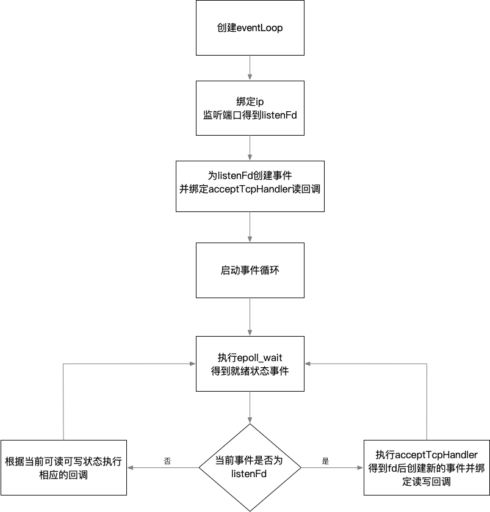

# Redis事件处理器

## Redis介绍

一句话描述：Redis是一款存储在**内存**中的Key-Value数据库。

与其他内存数据库相比，Redis还具备以下几个特征：

* **单线程**处理命令

* 支持持久化操作

* 丰富的数据结构

## Redis结构

#### Redis命令执行过程

一条Redis命令从开始到结束可分为三个阶段：第一步是建立连接，包括服务启动时开启TCP服务器以及处理客户端的连接并创建client对象；第二步是处理阶段，从socket读取数据到输入缓冲区通过解析获得命令，执行命令将返回值存储到输出缓冲区中；第三步是数据返回阶段，将返回值从输出缓冲区中写到socket，返回给客户端并关闭client。具体如下图：


#### Redis架构


## 网络I/O模型

一个TCP服务器一定会包含绑定IP(bind)、监听端口(listen)、接受客户端的(accept)连接并处理(recv)，在客户端连接(connect)并发送(send)数据后，就可以实现进程之间的通信了。

```
bind(127.0.0.1)
listenFd = listen(80)
while(true)
{
    fd = accept(listenFd)
    data = recv(fd)
    process(data)
}
```

查阅资料我们可以得知accept、recv函数是阻塞的，那么就可能存在A、B两个连接先后到达服务端但是A连接并没有发送数据，从而导致整个程序就会在recv处阻塞从而无法处理B连接以及接收它的数据。

#### BIO(Blocking I/O)

阻塞I/0，通过多线程来解决recv阻塞的问题

```
int main() 
{
    bind(127.0.0.1)
    listenFd = listen(80)
    while(true)
    {
      	fd = accept(listenFd)
        new Thread(() -> {
            process(fd)
        }).start();
    }
}
    
void process(fd) 
{
    while (true) {
      	data = recv(fd)
        run(data)
    }
}
```

BIO模型确实解决了recv阻塞的问题，但一个连接对应一个线程，在高并发的情况下也会存在**线程创建过多**从而带来内存消耗大以及线程上下文切换的问题。

#### NIO(Non-Blocking I/O)

如果accept、recv函数不是阻塞的，那么是不是就可以不用创建过多线程？

linux平台上可以调用fcntl()或者ioctl()函数，实例如下：

```javascript
fcntl(sockfd, F_SETFL, fcntl(sockfd, F_GETFL, 0) | O_NONBLOCK);  
ioctl(sockfd, FIONBIO, 1);  //1:非阻塞 0:阻塞 
```

当对一个Non-Blocking Socket执行读操作时，流程如图所示：


NIO伪代码如下：

```
int main() 
{
    bind(127.0.0.1)
    listenFd = listen(80)
    fcntl(listenFd, F_SETFL, fcntl(sockfd, F_GETFL, 0) | O_NONBLOCK);  
    fds = []int
    while(true)
    {
    	fd = accept(listenFd)
        if (fd == SUCCESS) {
      	    fcntl(fd, F_SETFL, fcntl(sockfd, F_GETFL, 0) | O_NONBLOCK); 
            fds = append(fds,fd)
        }
	for(i = 0;i<fds.length;i++) {
	    data = recv(fds[i])
	    if (data) {
	        run(data)
	    }
	}
    }
}
```

NIO模型因为其非阻塞的特性，使得它可以用单线程来处理多个网络并发I/O请求，在C10K的情况下，理论上也可以用一个线程来处理。

但是每次循环都要执行**O(n)** 次recv的系统调用来获得每个文件描述符的就绪状态也使得它效率较低。


#### IO多路复用

通过**一次系统调用**将监听的文件描述符从用户态拷贝到内核态就能得到所传递文件描述符的I/O状态

**epoll**

使用epoll_create创建一个epoll句柄，epoll_ctl为文件描述符绑定事件，epoll_wait获取处于就绪状态下的文件描述符数量。

伪代码如下：

```
int main() 
{
    bind(127.0.0.1)
    listenFd = listen(80)
    
    epollFd = epoll_create()
    
    event = new epoll_event()
    event.fd = listenFd
    event.events = EPOLLIN
    
    epoll_ctl(epollFd,EPOLL_CTL_ADD,listenFd,event)
    while(true)
    {
    	maxEvents = 1000;
    	listenEvents = new event[maxEvents];
    		
        nfds = epoll_wait(epollFd,listenEvents,maxEvents,5000)
        for(i=0;i<nfds;i++) {
            if(listenEvents[i].fd == listenFd) {
                fd = accept(listenfd);
        				
        	event = new epoll_event()
    		event.fd = listenFd
    		event.events = EPOLLIN
    		epoll_ctl(epollFd,EPOLL_CTL_ADD,listenFd,event)
            } else {
        	run(listenEvents[i])
            }
        }
    }
}
```


## 事件处理器(AE)

Redis把Socket连接当做一个事件，并为这个事件绑定读、写回调后存储到events中，每一次epoll_wait都会将就绪状态下的事件存储到fired里，并执行fired事件的读/写回调。

大致流程如下：




#### EventLoop

```c
typedef struct aeEventLoop {
    int maxfd;   /* highest file descriptor currently registered */
    int setsize; /* max number of file descriptors tracked */
    long long timeEventNextId;
    time_t lastTime;     /* Used to detect system clock skew */
    aeFileEvent *events; /* Registered events */
    aeFiredEvent *fired; /* Fired events */
    aeTimeEvent *timeEventHead;
    int stop;
    void *apidata; /* This is used for polling API specific data */
    aeBeforeSleepProc *beforesleep;
    aeBeforeSleepProc *aftersleep;
    int flags;
} aeEventLoop;

typedef struct aeFileEvent {
    int mask; /* one of AE_(READABLE|WRITABLE|BARRIER) */
    aeFileProc *rfileProc;
    aeFileProc *wfileProc;
    void *clientData;
} aeFileEvent;

typedef struct aeFiredEvent {
    int fd;
    int mask;
} aeFiredEvent;

typedef struct aeApiState {
    int epfd;
    struct epoll_event *events;
} aeApiState;

```

#### 创建eventLoop

```c
aeEventLoop *aeCreateEventLoop(int setsize) {
    aeEventLoop *eventLoop;
    int i;

    if ((eventLoop = zmalloc(sizeof(*eventLoop))) == NULL) goto err;
    eventLoop->events = zmalloc(sizeof(aeFileEvent)*setsize);
    eventLoop->fired = zmalloc(sizeof(aeFiredEvent)*setsize);
    if (eventLoop->events == NULL || eventLoop->fired == NULL) goto err;
    eventLoop->setsize = setsize;
    eventLoop->lastTime = time(NULL);
    eventLoop->timeEventHead = NULL;
    eventLoop->timeEventNextId = 0;
    eventLoop->stop = 0;
    eventLoop->maxfd = -1;
    eventLoop->beforesleep = NULL;
    eventLoop->aftersleep = NULL;
    eventLoop->flags = 0;
    if (aeApiCreate(eventLoop) == -1) goto err;
    /* Events with mask == AE_NONE are not set. So let's initialize the
     * vector with it. */
    for (i = 0; i < setsize; i++)
        eventLoop->events[i].mask = AE_NONE;
    return eventLoop;

err:
    if (eventLoop) {
        zfree(eventLoop->events);
        zfree(eventLoop->fired);
        zfree(eventLoop);
    }
    return NULL;
}
```


#### 监听端口

```c
int listenToPort(int port, int *fds, int *count) {
    int j;

    /* Force binding of 0.0.0.0 if no bind address is specified, always
     * entering the loop if j == 0. */
    if (server.bindaddr_count == 0) server.bindaddr[0] = NULL;
    for (j = 0; j < server.bindaddr_count || j == 0; j++) {
        if (server.bindaddr[j] == NULL) {
            int unsupported = 0;
            /* Bind * for both IPv6 and IPv4, we enter here only if
             * server.bindaddr_count == 0. */
            fds[*count] = anetTcp6Server(server.neterr,port,NULL,
                server.tcp_backlog);
            if (fds[*count] != ANET_ERR) {
                anetNonBlock(NULL,fds[*count]);
                (*count)++;
            } else if (errno == EAFNOSUPPORT) {
                unsupported++;
                serverLog(LL_WARNING,"Not listening to IPv6: unsupported");
            }

            if (*count == 1 || unsupported) {
                /* Bind the IPv4 address as well. */
                fds[*count] = anetTcpServer(server.neterr,port,NULL,
                    server.tcp_backlog);
                if (fds[*count] != ANET_ERR) {
                    anetNonBlock(NULL,fds[*count]);
                    (*count)++;
                } else if (errno == EAFNOSUPPORT) {
                    unsupported++;
                    serverLog(LL_WARNING,"Not listening to IPv4: unsupported");
                }
            }
            /* Exit the loop if we were able to bind * on IPv4 and IPv6,
             * otherwise fds[*count] will be ANET_ERR and we'll print an
             * error and return to the caller with an error. */
            if (*count + unsupported == 2) break;
        } else if (strchr(server.bindaddr[j],':')) {
            /* Bind IPv6 address. */
            fds[*count] = anetTcp6Server(server.neterr,port,server.bindaddr[j],
                server.tcp_backlog);
        } else {
            /* Bind IPv4 address. */
            fds[*count] = anetTcpServer(server.neterr,port,server.bindaddr[j],
                server.tcp_backlog);
        }
        if (fds[*count] == ANET_ERR) {
            int net_errno = errno;
            serverLog(LL_WARNING,
                "Could not create server TCP listening socket %s:%d: %s",
                server.bindaddr[j] ? server.bindaddr[j] : "*",
                port, server.neterr);
                if (net_errno == ENOPROTOOPT     || net_errno == EPROTONOSUPPORT ||
                    net_errno == ESOCKTNOSUPPORT || net_errno == EPFNOSUPPORT ||
                    net_errno == EAFNOSUPPORT    || net_errno == EADDRNOTAVAIL)
                    continue;
            return C_ERR;
        }
        anetNonBlock(NULL,fds[*count]);
        (*count)++;
    }
    return C_OK;
}
```

#### 为listenFd创建事件

```c
for (j = 0; j < server.ipfd_count; j++) {
        // 为监听端口的文件描述符绑定事件,回调方法为acceptTcpHandler
        if (aeCreateFileEvent(server.el, server.ipfd[j], AE_READABLE,
            acceptTcpHandler,NULL) == AE_ERR)
            {
                serverPanic(
                    "Unrecoverable error creating server.ipfd file event.");
            }
    }
```

#### 启动事件循环

```c
void aeMain(aeEventLoop *eventLoop) {
    eventLoop->stop = 0;
    while (!eventLoop->stop) {
        aeProcessEvents(eventLoop, AE_ALL_EVENTS|
                                   AE_CALL_BEFORE_SLEEP|
                                   AE_CALL_AFTER_SLEEP);
    }
}
```

#### 执行epoll_wait并处理事件

```c
numevents = aeApiPoll(eventLoop, tvp);
if (eventLoop->aftersleep != NULL && flags & AE_CALL_AFTER_SLEEP)
            eventLoop->aftersleep(eventLoop);
for (j = 0; j < numevents; j++) {
    aeFileEvent *fe = &eventLoop->events[eventLoop->fired[j].fd];
    int mask = eventLoop->fired[j].mask;
    int fd = eventLoop->fired[j].fd;
    int fired = 0; /* Number of events fired for current fd. */
    int invert = fe->mask & AE_BARRIER;
    if (!invert && fe->mask & mask & AE_READABLE) {
        fe->rfileProc(eventLoop,fd,fe->clientData,mask);
        fired++;
        fe = &eventLoop->events[fd]; /* Refresh in case of resize. */
    }

            /* Fire the writable event. */
    if (fe->mask & mask & AE_WRITABLE) {
        if (!fired || fe->wfileProc != fe->rfileProc) {
            fe->wfileProc(eventLoop,fd,fe->clientData,mask);
            fired++;
        }
    }
    .......
}
```

#### aeApiPoll

```c
// 将就绪的文件描述符放入fired队列中准备处理
static int aeApiPoll(aeEventLoop *eventLoop, struct timeval *tvp) {
    aeApiState *state = eventLoop->apidata;
    int retval, numevents = 0;

    retval = epoll_wait(state->epfd,state->events,eventLoop->setsize,
            tvp ? (tvp->tv_sec*1000 + tvp->tv_usec/1000) : -1);
    if (retval > 0) {
        int j;

        numevents = retval;
        for (j = 0; j < numevents; j++) {
            int mask = 0;
            struct epoll_event *e = state->events+j;

            if (e->events & EPOLLIN) mask |= AE_READABLE;
            if (e->events & EPOLLOUT) mask |= AE_WRITABLE;
            if (e->events & EPOLLERR) mask |= AE_WRITABLE|AE_READABLE;
            if (e->events & EPOLLHUP) mask |= AE_WRITABLE|AE_READABLE;
            eventLoop->fired[j].fd = e->data.fd;
            eventLoop->fired[j].mask = mask;
        }
    }
    return numevents;
}
```

## 最后

#### 思考：

* 为什么Redis使用的是单线程
* Redis真的是单线程的吗
* 我们能从Redis事件模型中学到什么

